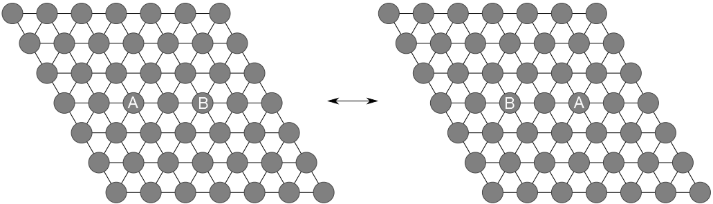
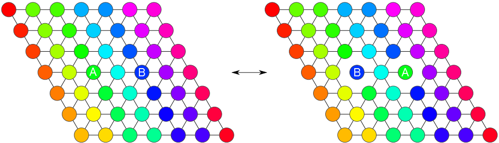

# ColloidalStatMech
Interactive, web-based illustrations for exploring statistical mechanical concepts in colloidal physics, based on research at Harvard. 

Colloidal particles that can be visualized with an optical microscope, but which are small enough that they are brownian, provide unique opportunities for experimental tests of statistical mechanics.

Research by Guangnan Meng, Natalie Arkus, Vinny Manoharan and Michael Brenner explored how colloidal particles self-assemble if each is of the same chemical species. Then research by Becca Perry, Jesse Collins, W. Ben Rogers, Natalie Arkus, Zorana Zeravcic, Vinny Manoharan and Micheal Brenner explored increasing the number of chemical species, and seeing how this affected the structures that formed in statistical equilibrium. 

To understand and explain the concepts that emerged from this work, I've made an interactive visualization of identical vs. n-component, highly specific particles. Learn more by exploring this interactive explanation: (http://jeswcollins.github.io/ColloidalStatMech/)

The illustrations below came from the interactive visualization, and originally were published [here](http://dash.harvard.edu/handle/1/12274201).

