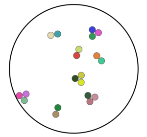

# ColloidalStatMech
ColloidalStatMech provides interactive, web-based illustrations for exploring statistical mechanical concepts in colloidal physics, based on research at Harvard. Try it here: http://jeswcollins.github.io/ColloidalStatMech/.

#Interactive "Swapping" Visualization
The illustrations below originally were published [here](http://dash.harvard.edu/handle/1/12274201).

**To Do**
<li>Make modular</li>
<li>Make mobile friendly</li>

#Brownian Motion Simulation
This code builds off from [MSDN's Intermediate SVG javascript tutorial.](https://msdn.microsoft.com/en-us/library/gg193985(v=vs.85).aspx)

**To Do**
<li>Add adjustable temperature</li>
<li>Add specificity</li>
<li>Make specificity adjustable</li>
<li>Add placing and swapping spheres on clicks</li>

#Background

Colloidal particles that can be visualized with an optical microscope, but which are small enough that they are "random walkers", provide unique opportunities for experimental tests of statistical mechanics.

Research by Guangnan Meng, Natalie Arkus, Vinny Manoharan and Michael Brenner explored how colloidal particles self-assemble if each is of the same chemical species. Then research by Becca Perry, Jesse Collins, W. Ben Rogers, Natalie Arkus, Zorana Zeravcic, Vinny Manoharan and Micheal Brenner explored increasing the number of chemical species, and seeing how this affected the structures that formed in statistical equilibrium. 

To understand and explain the concepts that emerged from this work, I've made an interactive visualization of identical vs. n-component, highly specific particles. I've also started work on a Brownian motion visualization/simulation. I'm busy with experiments so if you want to contribute please do.
